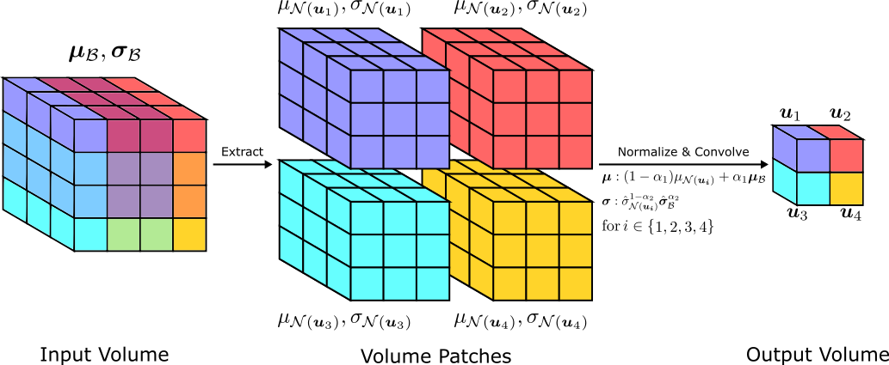
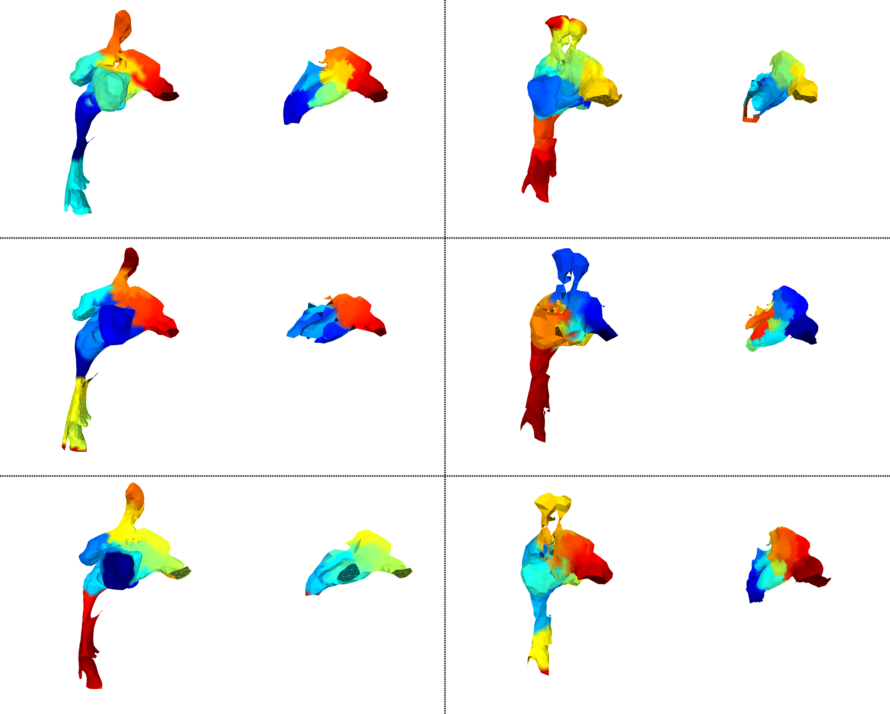

# Neighborhood Normalization for Robust Geometric Feature Learning



This codebase implements the method described in the paper:

***Neighborhood Normalization for Robust Geometric Feature Learning***

Xingtong Liu*, Benjamin Killeen*, Ayushi Sinha, Masaru Ishii, Gregory D. Hager, Russell H. Taylor, Mathias Unberath

In ***2021 Conference on Computer Vision and Pattern Recognition (CVPR)***

Please contact [**Xingtong Liu**](https://www.linkedin.com/in/xingtong-liu-b43b27131/) (xingtongliu@jhu.edu) or [**Mathias Unberath**](https://www.cs.jhu.edu/faculty/mathias-unberath/) (unberath@jhu.edu) if you have any questions.

## Dependencies

```MinkowskiEngine(0.5.4 tested), torch(1.7.1 tested), open3d(0.9.0.0 tested), pyvista, pyacvd, pycuda, tensorboardX, scikit-image, scikit-learn, opencv-python, MulticoreTSNE, umap-learn, torch-geometric, scipy, psutil, tqdm, pathlib, numpy```

## Datasets

### 3DMatch

1. Download original dataset
   using [this script](http://vision.princeton.edu/projects/2016/3DMatch/downloads/rgbd-datasets/download.sh).
2. Download information of pairs with scene
   overlap [here](https://drive.google.com/file/d/1pdAbmjmb3mPEQxIA7nPMtxWPsJ00xwjJ/view?usp=sharing). Note the
   train/val/test split provided here is the one used in this work.
3. Generate mesh dataset using ```scripts/generate_3dmatch_mesh.py```. One example
   is ```/path/to/python /path/to/generate_3dmatch_mesh.py --data_root /path/to/3dmatch/original/dataset --output_root /path/to/3dmatch/mesh/output```
4. Split the generated mesh dataset in step 3 in the same way as the pair information in step 2. Store these two types
   of data in the same folder. Because temporary data will be generated during network training, at least 100 GB storage
   space is required for this dataset.
5. For evaluation on the standard benchmark, download the test point cloud
   dataset [here](https://drive.google.com/file/d/18ub42ZuXrjalyt6VpD06jz9k0jk-9UDe/view?usp=sharing).
6. For evaluation on the resolution mismatch benchmark, use the mesh data in the test split generated in step 3. Before
   evaluation, copy the ```*-evaluation``` folders downloaded in step 5 to the test split generated in step 3.

### KITTI

1. Download velodyne dataset from [this link](http://www.cvlibs.net/download.php?file=data_odometry_velodyne.zip). 85 GB
   storage space is needed.
2. train/val/test split has been specified in the dataset class ```KITTIPairDataset```
   in ```datasets/kitti_dataset.py``` and no further operations are needed.

### Nasal Cavity

1. Download dataset for network training and
   evluation [here](https://livejohnshopkins-my.sharepoint.com/:f:/g/personal/xliu89_jh_edu/EiwCvDb4CP9Fo_RjVnHszbwBFOjmnzMeZbfZMVxzHxBOUw?e=f6C8F2)
   . Data inside ```low_resolution``` folder is used for computation efficiency reason.
2. The 52 head CT scans from several public datasets and the corresponding statistical shape models are
   provided [here](https://livejohnshopkins-my.sharepoint.com/:f:/g/personal/xliu89_jh_edu/EtlYc_XbGzdBqYb94nxzLfgBAwrE-25R30ySj_LhB4H-mA?e=Ke0MQG)
   . Note this is not needed for this work and we provide it for other potential research topics.
3. For experiments in this work, train/val/test split on this dataset simply use different range of PCA mode weights.

## Network Training

1. ```train_3dmatch.py``` is for training a 3D geometric descriptor on the 3DMatch dataset. One example to run this
   script is ```/path/to/python /path/to/train_3dmatch.py --config_path /path/to/config/file```. Example config files
   are provided in the ```scripts``` folder. To train a network for the standard benchmark (fixed resolution), one
   example config file is ```train_3dmatch_standard.json```. To train a network with Batch-Neighborhood Normalization (
   B-NHN)
   for the resolution mismatch benchmark, the example config file is ```train_3dmatch_mismatch_bnhn.json```. To train
   with Neighborhood Normalization (NHN), one example config file is ```train_3dmatch_nhn.json```. For the two-stage
   training strategy mentioned in the paper, a network should first be trained with
   ```train_3dmatch_nhn.json``` until convergence. Then it should be trained with
   ```train_3dmatch_mismatch_nhn_to_bnhn.json``` to adjust the weights of B-NHNs.
2. ```train_kitti.py``` is for training a 3D geometric descriptor on the KITTI dataset. One example to run this script
   is ```/path/to/python /path/to/train_kitti.py --config_path /path/to/config/file```. The example config files for the
   standard and resolution mismatch benchmarks are ```train_kitti_standard.json```
   and ```train_kitti_mismatch.json```, respectively.
3. ```train_nasal.py``` is for training a 3D geometric descriptor on the Nasal Cavity dataset. One example to run this
   script is ```/path/to/python /path/to/train_nasal.py --config_path /path/to/config/file```. The example config file
   for the resolution mismatch benchmark is ```train_nasal_mismatch.json```.

## Evaluation

1. ```evaluation/evaluation_3dmatch.py``` is to evaluate Feature Match Rate (FMR) on the 3DMatch dataset. One example to
   run this script is ```/path/to/python /path/to/evaluation_3dmatch.py --config_path /path/to/config/file```. Example
   config files for the standard and resolution mismatch benchmarks are ```eval_3dmatch_standard.json```
   amd ```eval_3dmatch_mismatch.json```, respectively.

2. ```evaluation/evaluation_kitti_standard.py``` is to evaluate FMR and Registration Error on the standard benchmark of
   KITTI dataset. One example to run this script
   is ```/path/to/python /path/to/evaluation_kitti_standard.py --config_path /path/to/config/file```. One example config
   file is ```eval_kitti_standard.json```.

3. ```evaluation/evaluation_kitti_mismatch.py``` is to evaluate FMR on the resolution mismatch benchmark of KITTI
   dataset. One example to run this script
   is ```/path/to/python /path/to/evaluation_kitti_mismatch.py --config_path /path/to/config/file```. One example config
   file is ```eval_kitti_mismatch.json```.

4. ```evaluation/evaluation_nasal.py``` is to evaluate FMR on the resolution mismatch benchmark of Nasal Cavity dataset.
   One example to run this script
   is ```/path/to/python /path/to/evaluation_nasal.py --config_path /path/to/config/file```. One example config file
   is ```eval_nasal_mismatch.json```.

## Pre-trained Models

We provide pre-trained models with Batch-Neighborhood Normalization on the datasets used in this work.
```net_norm_type``` and ```net_upsample_type``` in the config files corresponds to the two terms separated by ```+```
below. These models produced experiment results reported in the paper for the B-NHN normalization type.

| Benchmark / Dataset | 3DMatch | KITTI | Nasal Cavity |
| ----------- | ----------- | ----------- | ----------- |
| Standard | [B-NHN + Transpose](https://drive.google.com/file/d/1KMfrKV5U8GRvZakKVkhwsZq7t7JuGB7g/view?usp=sharing) | [B-NHN + Pool](https://drive.google.com/file/d/1haLhw1Mgiw6Rse3yDmzw9YHzdqZawUyr/view?usp=sharing) | N/A |
| Resolution mismatch | [B-NHN + Pool](https://drive.google.com/file/d/1Vj8bxuoMI-cldGVm-Ph8Lqr_viV9dlq5/view?usp=sharing) | [B-NHN + Pool](https://drive.google.com/file/d/1QfiMLU2ypT7qeMUhvI-RLWaAitXtcyv8/view?usp=sharing) | [B-NHN + Pool](https://drive.google.com/file/d/1679hXaV95Hcg3-zgOBA1B-prbomstgwE/view?usp=sharing) |

## Visualization

Here we present feature embeddings of several sample pairs from the three datasets with resolution mismatch. Features
are reduced to 3-dimension for color display using UMAP.

### 3DMatch


### KITTI


### Nasal Cavity

